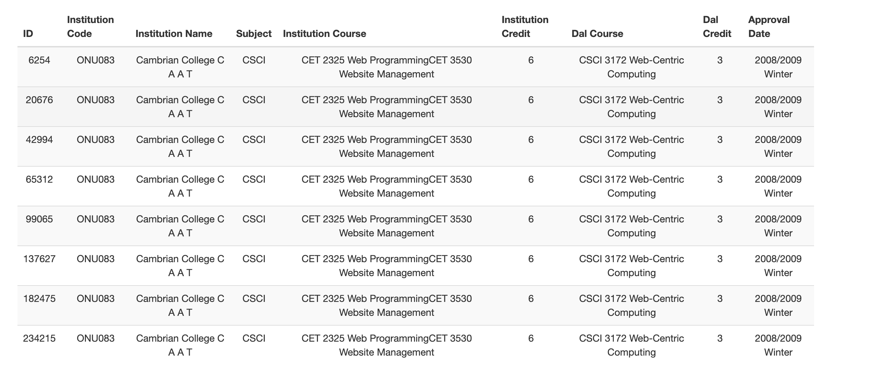
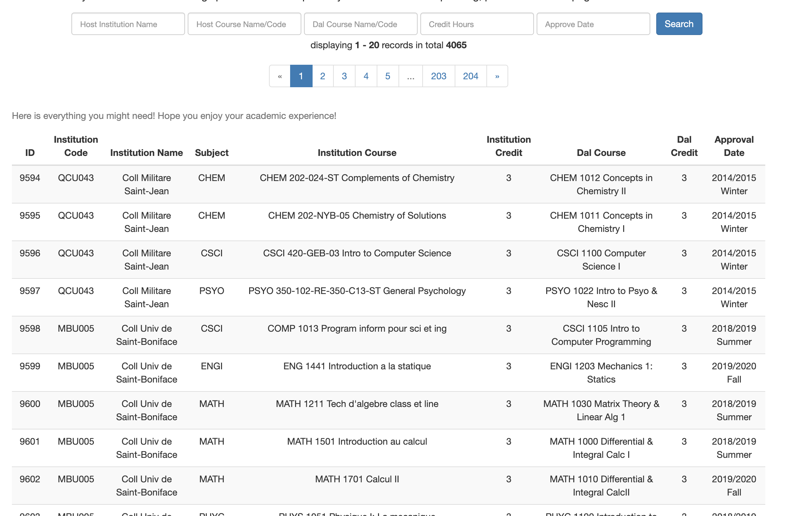
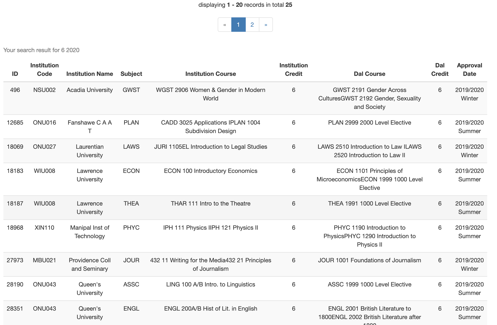
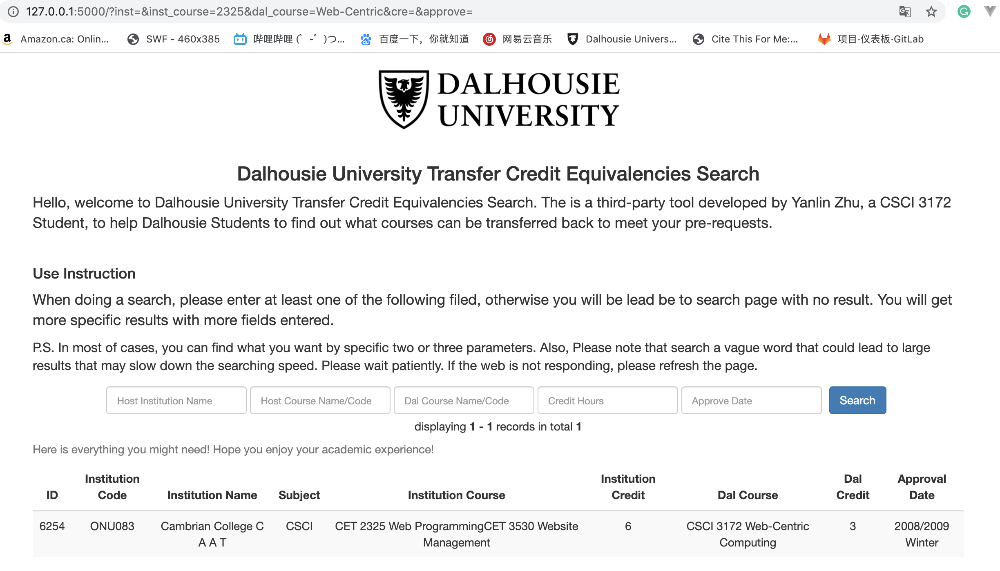
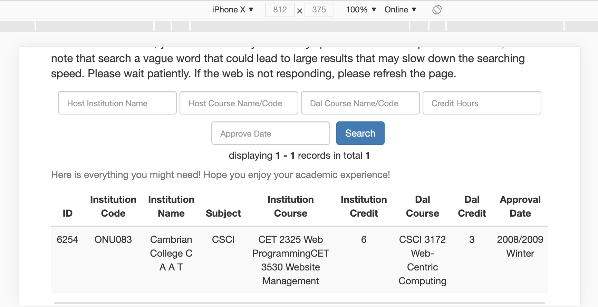
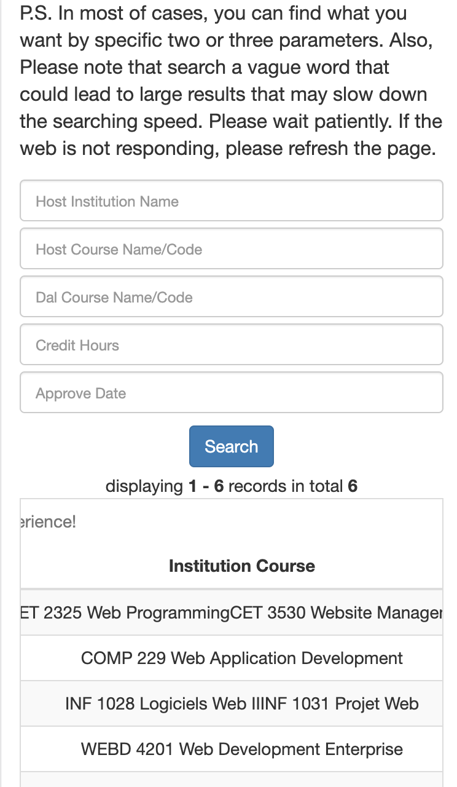
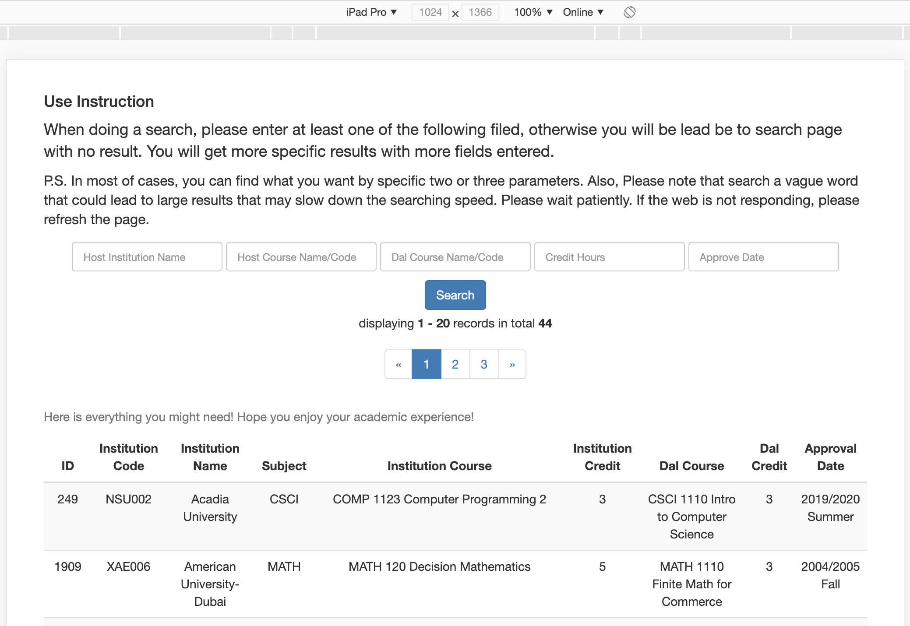

# CSCI 3172 Lab 5&6
## Yanlin Zhu
## B00812966


### About the project 
 The project consists of two separate parts：Web crawler and Search Web.

 The first part can be found in main.py which is the python script that crawls the Dalhousie Credit Transfer Equivalent Site to store all Course information into a .csv file called courseData.csv. The file is set a+ so you can just run to test it. The result is also printed in the console.

 (P.S. I do not recommend you to run the script to retrieve data as it may take 3/4 hours to get all data)  

 After  finish the web crawler, I create a Flask web app to index the result. There are few things need to be done before you successfully run the app.

#### Load Data into your own database

   You can choose to import the .sql file to your database or use the following sql to create the table then import the csv file

   ```
   CREATE DATABASE IF NOT EXISTS `3172lab5` DEFAULT CHARACTER SET utf8 COLLATE utf8_general_ci;
USE `3172lab5`;


DROP TABLE IF EXISTS `Course`;
CREATE TABLE `Course` (
  `id` int(64) NOT NULL,
  `inst_code` varchar(64) NOT NULL,
  `inst_name` varchar(64) NOT NULL,
  `subject` varchar(64) NOT NULL,
  `inst_course` varchar(1024) NOT NULL,
  `inst_credit` varchar(11) NOT NULL,
  `dal_course` varchar(1024) NOT NULL,
  `dal_credit` varchar(11) NOT NULL,
  `last_assess` varchar(64) NOT NULL
) ENGINE=InnoDB DEFAULT CHARSET=utf8;
   ```
   After create the db and table, you can import csv using ";" as delimitator and Column name as "inst_code, inst_name,subject,inst_course,inst_credit,dal_course,dal_credit,last_assess" 


#### Install Flask Dependencies and Config db

After data has been loaded into your own db, go to app.py and change the db config to your own settings.
Then open terminal and use pip3 to install packages  
##### Insatall Flask
``` pip3 install -U Flask ```
###### Install Flask-Bootstrap
``` pip3 install flask-bootstrap``` 

###### Install Flask-MySQLdb
```pip3 install flask-mysqldb```
###### Install Flask-Pagination
``` pip3 install - U flask-paginate```

After finish this you can run the app using Pycharm run tool by setting up configuration or run

 ``` export FLASK_APP= app.py```

 ```Pyhton3 -m flask run```

***
### Screenshots

##### Please note that the screenshot was taken one version ahead of the final submission. The final version will have a line with your search keyword above the result table


##### Home



#### Institution Single



#### Course Code Single


#### Approve Date Single



#### 3172 Single


#### 3172 two params




#### phone horizontal



#### phone vertical



#### tablet
